# ARQUITECTURA DEL SISTEMA
## ESPE MedSafe - Semana 2

---

## 1. ARQUITECTURA GENERAL DEL SISTEMA

### 1.1 Vista de Alto Nivel

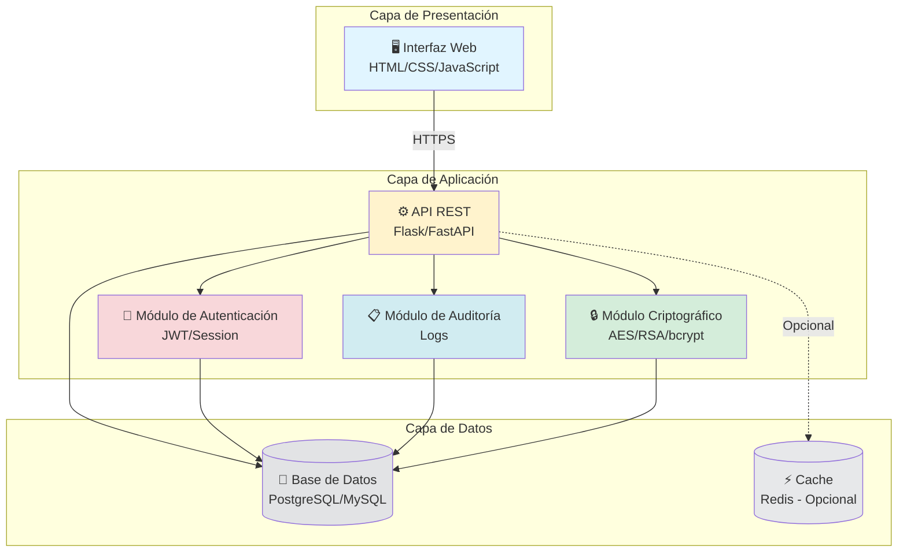

### 1.2 Arquitectura Cliente-Servidor

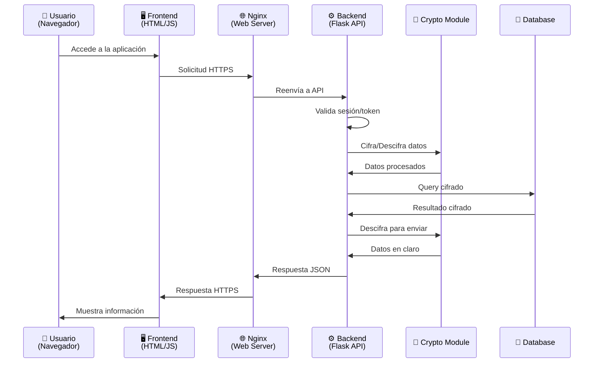

---

## 2. ARQUITECTURA DE CAPAS DETALLADA

### 2.1 Capa de Presentación (Frontend)

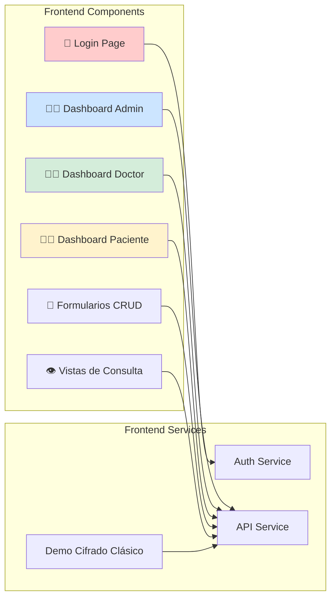

**Componentes:**
- **Login Page**: Formulario de autenticación con validación
- **Dashboards**: Interfaces específicas por rol
- **Formularios CRUD**: Crear/editar pacientes e historias clínicas
- **Vistas de Consulta**: Lectura de datos
- **Demo Cifrado**: Módulo educativo interactivo

**Tecnologías:**
- HTML5, CSS3, JavaScript ES6+
- Bootstrap 5 o React (a definir)
- Axios o Fetch API para comunicación
- LocalStorage para tokens de sesión

---

### 2.2 Capa de Aplicación (Backend)

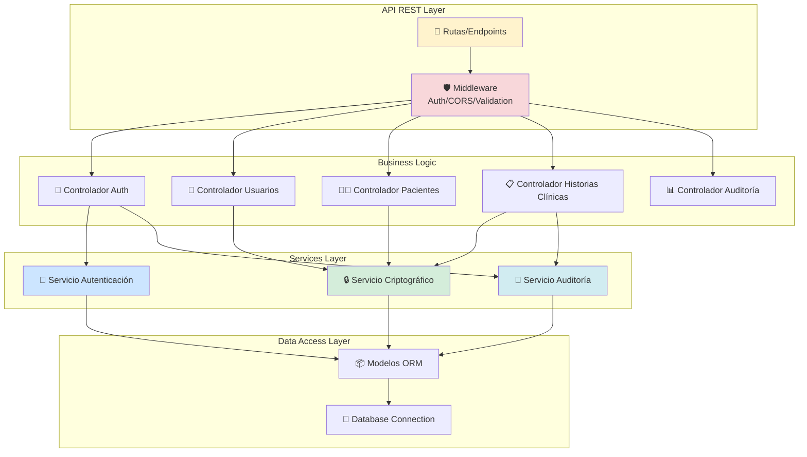

**Estructura de Directorios Backend:**
```
backend/
├── app.py                    # Punto de entrada de la aplicación
├── config.py                 # Configuración (DB, claves, etc.)
├── requirements.txt          # Dependencias Python
├── routes/                   # Definición de rutas API
│   ├── auth_routes.py
│   ├── user_routes.py
│   ├── patient_routes.py
│   ├── medical_record_routes.py
│   └── audit_routes.py
├── controllers/              # Lógica de negocio
│   ├── auth_controller.py
│   ├── user_controller.py
│   ├── patient_controller.py
│   ├── medical_record_controller.py
│   └── audit_controller.py
├── services/                 # Servicios reutilizables
│   ├── crypto_service.py     # AES, RSA, SHA-256
│   ├── auth_service.py       # JWT, bcrypt
│   ├── audit_service.py      # Logging
│   └── classic_cipher.py     # César, Vigenère
├── models/                   # Modelos de base de datos (ORM)
│   ├── user.py
│   ├── patient.py
│   ├── medical_record.py
│   └── audit_log.py
├── middleware/               # Middleware personalizado
│   ├── auth_middleware.py
│   ├── role_middleware.py
│   └── validation_middleware.py
└── utils/                    # Utilidades
    ├── validators.py
    └── helpers.py
```

---

### 2.3 Capa de Datos

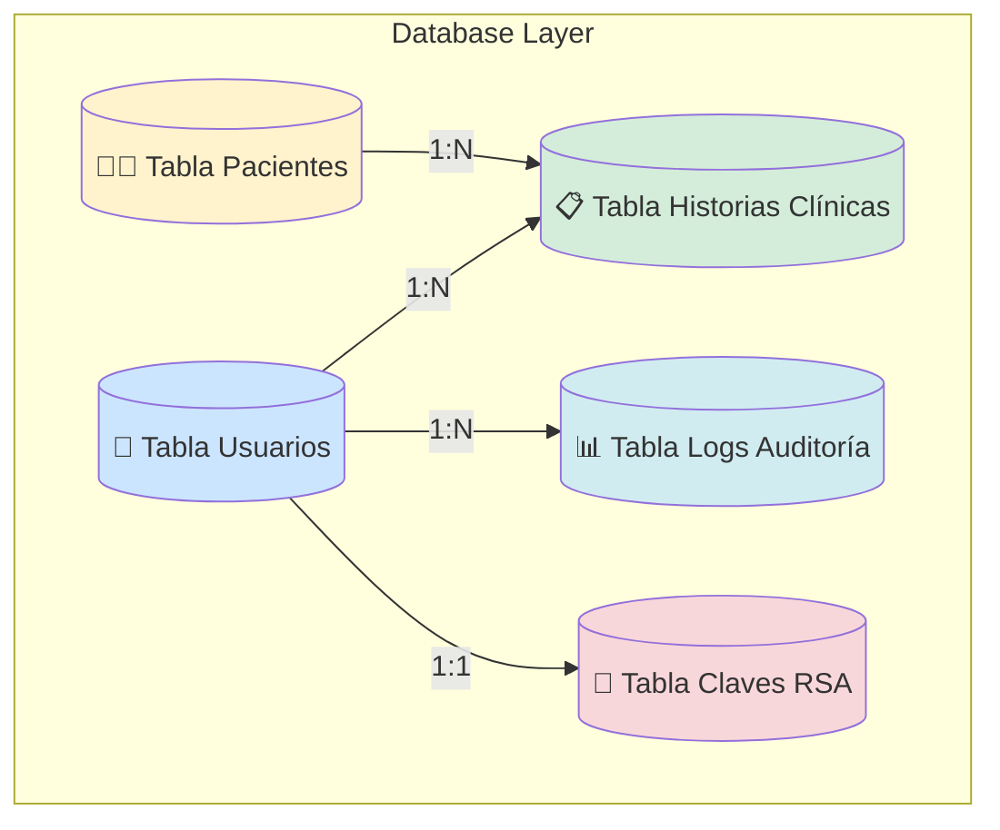

---

## 3. FLUJO DE DATOS CON CIFRADO

### 3.1 Flujo de Creación de Historia Clínica

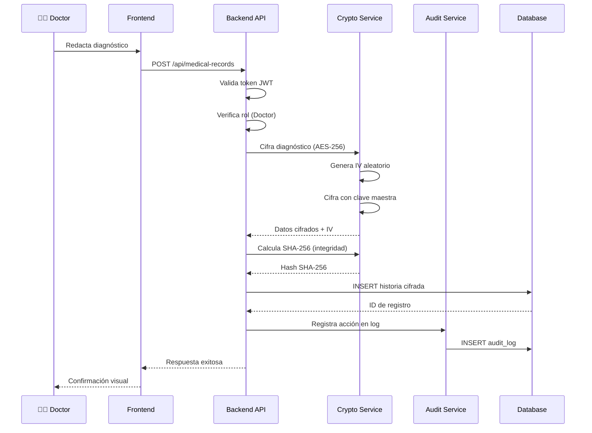

### 3.2 Flujo de Consulta de Historia Clínica

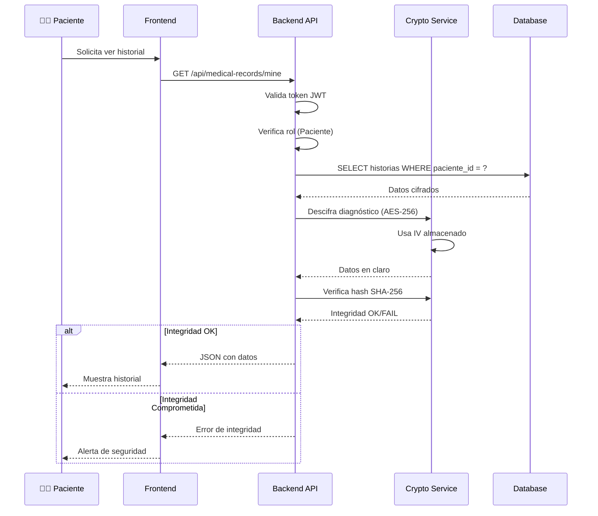

### 3.3 Flujo de Autenticación con bcrypt

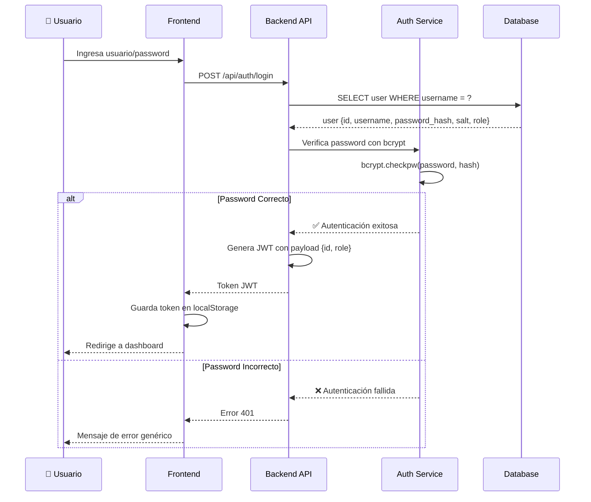

---

## 4. SEGURIDAD EN LA ARQUITECTURA

### 4.1 Capas de Seguridad

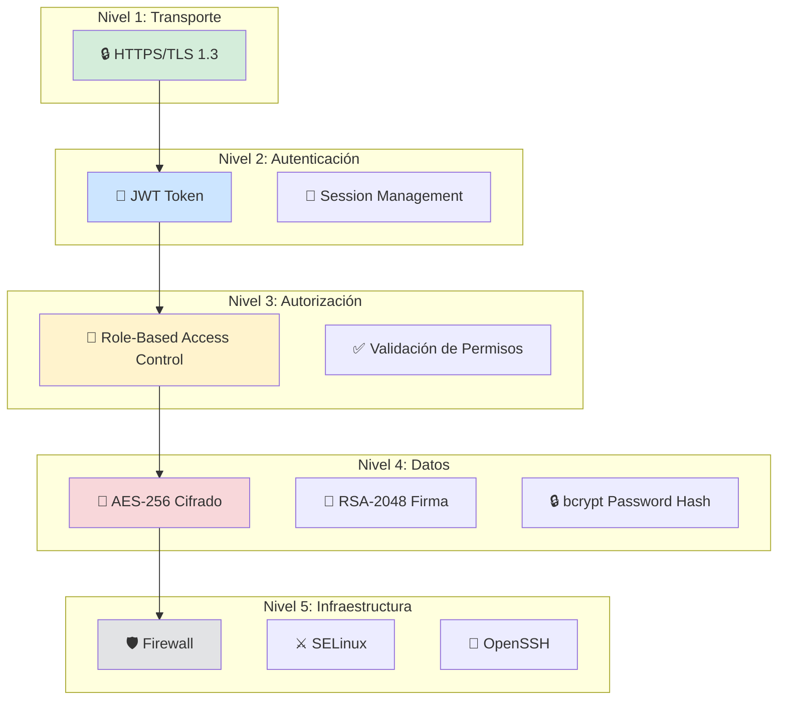

### 4.2 Protecciones Implementadas

| Amenaza | Protección | Capa |
|---------|-----------|------|
| Man-in-the-Middle | HTTPS/TLS | Transporte |
| Robo de sesión | JWT con expiración (30 min) | Autenticación |
| Acceso no autorizado | RBAC + Middleware | Autorización |
| SQL Injection | ORM + Queries parametrizadas | Datos |
| XSS | Validación + Escapado | Presentación |
| CSRF | CSRF Tokens | Presentación |
| Fuerza bruta | Rate limiting + bcrypt lento | Autenticación |
| Exposición de datos | AES-256 en BD | Datos |
| Pérdida de integridad | SHA-256 checksum | Datos |

---

## 5. INFRAESTRUCTURA Y DESPLIEGUE

### 5.1 Arquitectura de Despliegue

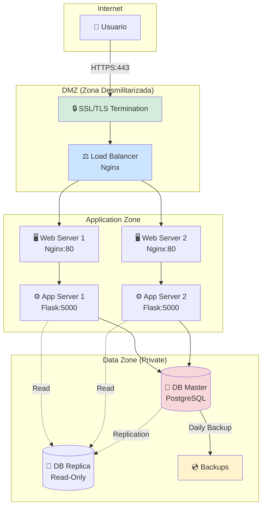

### 5.2 Configuración de Servidor (Simplificada para el proyecto)

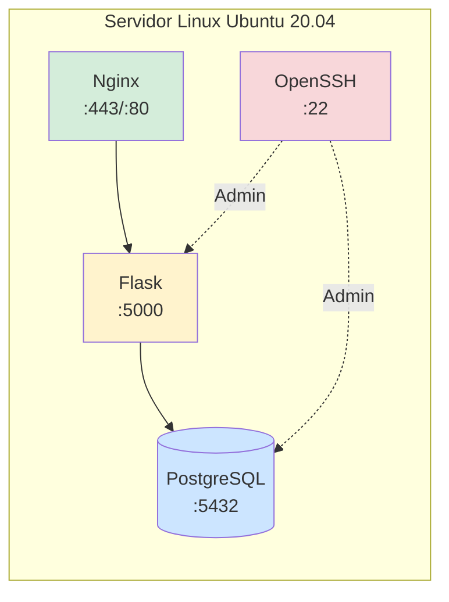

---

## 6. ESCALABILIDAD Y EXTENSIBILIDAD

### 6.1 Puntos de Extensión

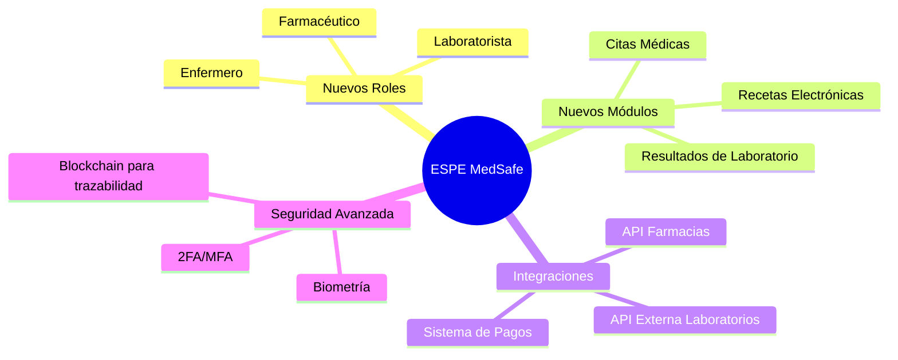

### 6.2 Arquitectura Modular

El sistema está diseñado con módulos independientes que permiten:
- ✅ Agregar nuevos endpoints sin modificar existentes
- ✅ Cambiar implementaciones de cifrado sin cambiar la interfaz
- ✅ Escalar horizontalmente (más servidores)
- ✅ Migrar a microservicios en el futuro

---

## 7. TECNOLOGÍAS Y VERSIONES

| Componente | Tecnología | Versión |
|------------|-----------|---------|
| Backend Framework | Flask | 3.0.0 |
| ORM | SQLAlchemy | 2.0+ |
| Criptografía | cryptography | 41.0+ |
| Password Hash | bcrypt | 4.1+ |
| WSGI Server | Gunicorn | 21.2+ |
| Web Server | Nginx | 1.24+ |
| Base de Datos | PostgreSQL | 15+ |
| Python | CPython | 3.11+ |

---

## 8. VISUALIZACIÓN EN VS CODE

Para ver estos diagramas renderizados en VS Code:

1. Instala la extensión: **Markdown Preview Mermaid Support**
2. Abre este archivo
3. Presiona `Ctrl+Shift+V` (Vista previa de Markdown)
4. Los diagramas se renderizarán automáticamente

Para exportar a imagen:
- Usa la extensión **Mermaid Editor** 
- O copia el código Mermaid a https://mermaid.live/

---

**Fecha**: 8 de enero de 2026  
**Equipo**: ESPE MedSafe  
**Semana**: 2 - Diseño del Sistema
