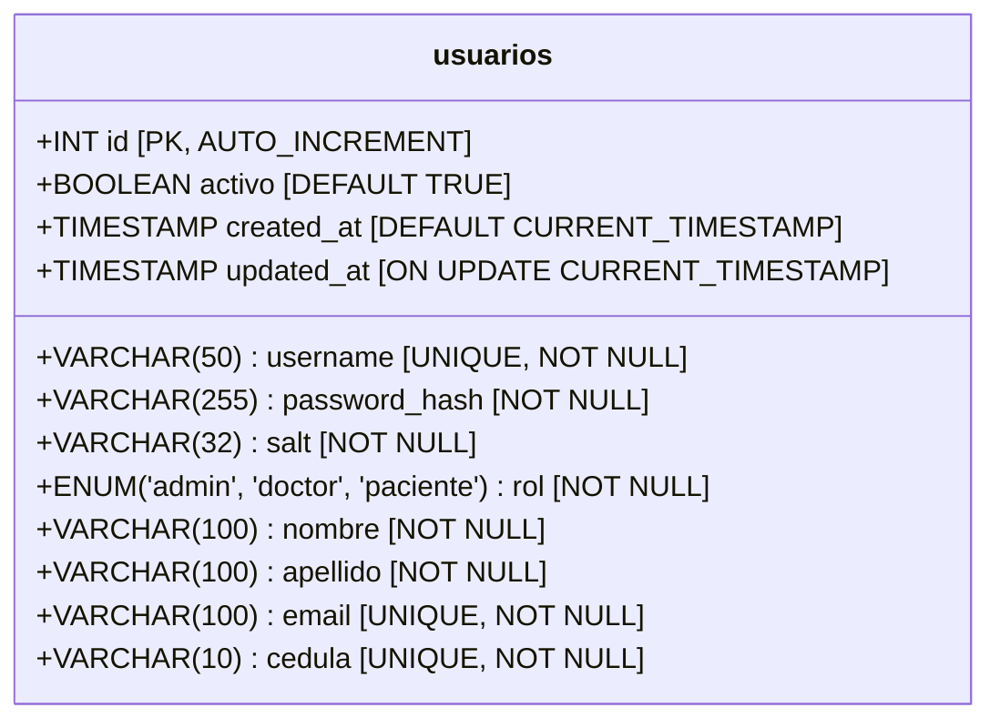
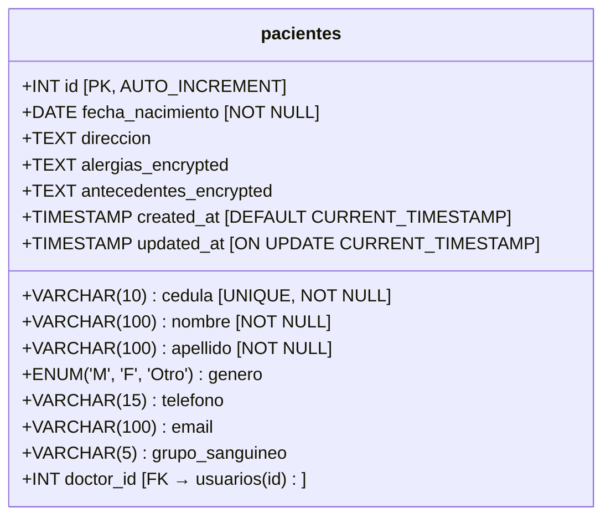
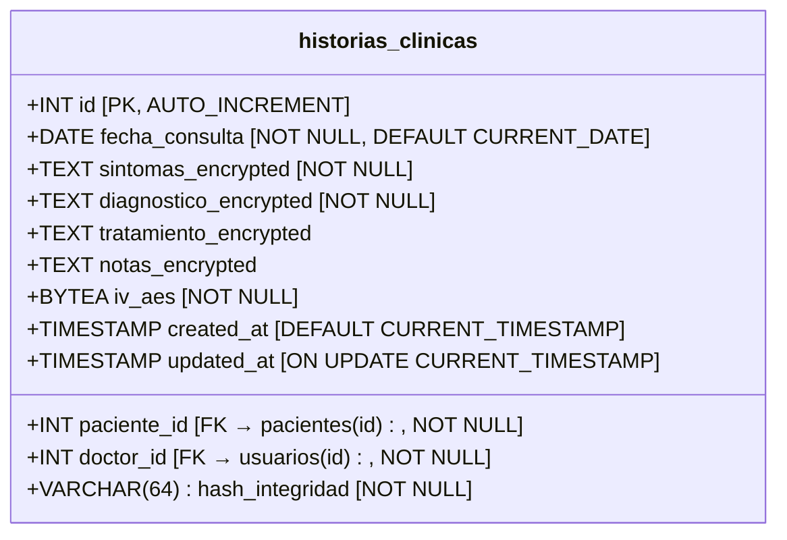
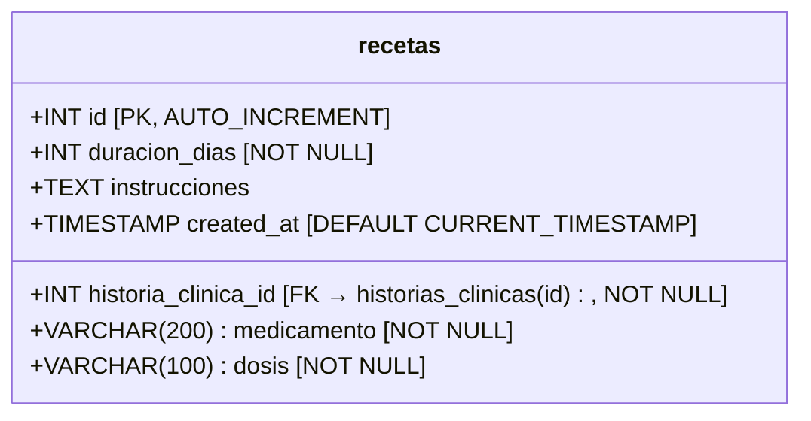
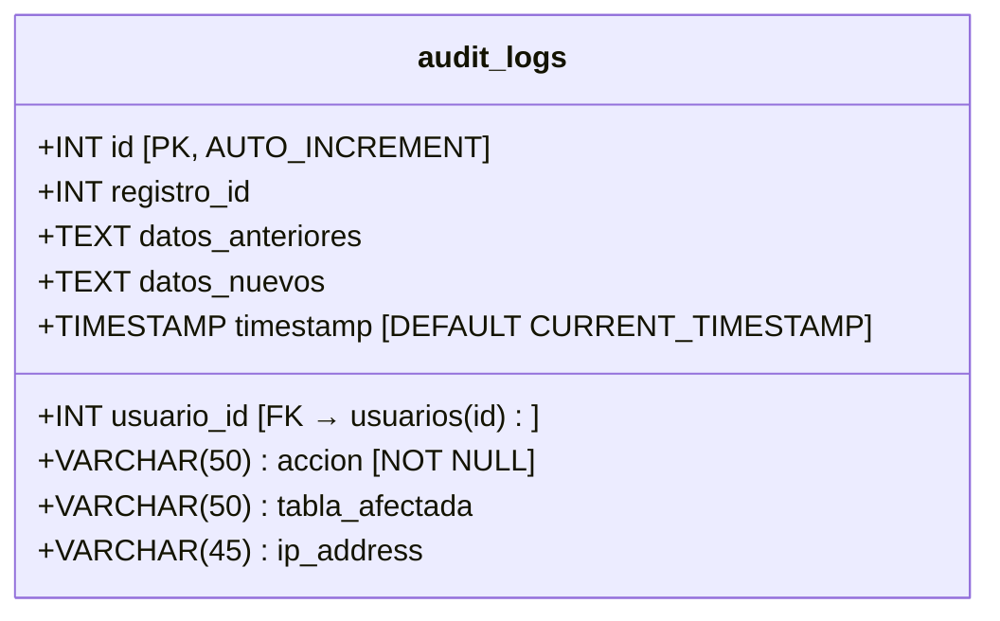
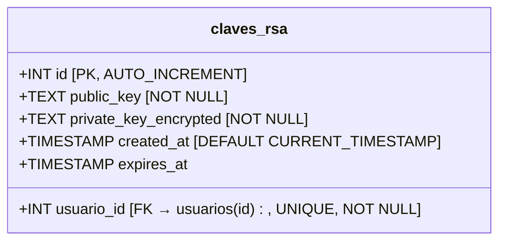
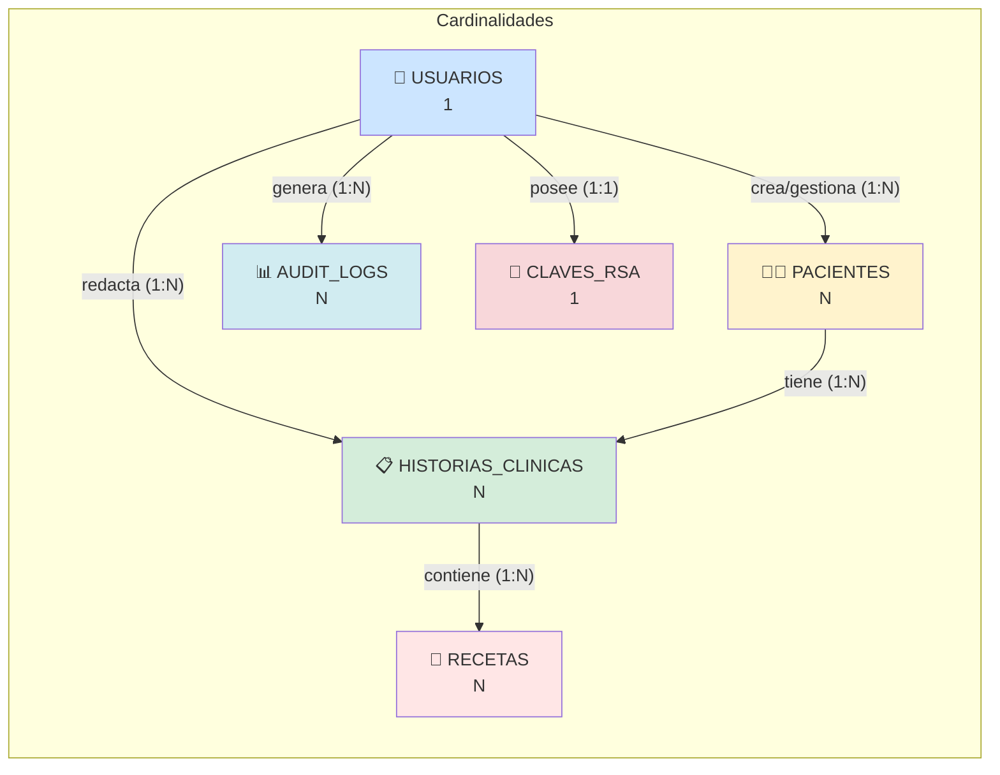

# MODELO DE BASE DE DATOS
## ESPE MedSafe - Semana 2

---

## 1. DIAGRAMA ENTIDAD-RELACIÓN

### 1.1 Modelo Conceptual

```mermaid
erDiagram
    USUARIOS ||--o{ PACIENTES : "crea/gestiona"
    USUARIOS ||--o{ HISTORIAS_CLINICAS : "redacta"
    PACIENTES ||--o{ HISTORIAS_CLINICAS : "tiene"
    USUARIOS ||--o{ AUDIT_LOGS : "genera"
    USUARIOS ||--o| CLAVES_RSA : "posee"
    HISTORIAS_CLINICAS ||--o{ RECETAS : "contiene"
    
    USUARIOS {
        int id PK
        varchar username UK
        varchar password_hash
        varchar salt
        enum rol
        varchar nombre
        varchar apellido
        varchar email UK
        varchar cedula UK
        boolean activo
        timestamp created_at
        timestamp updated_at
    }
    
    PACIENTES {
        int id PK
        varchar cedula UK
        varchar nombre
        varchar apellido
        date fecha_nacimiento
        varchar genero
        varchar telefono
        varchar email
        varchar direccion
        varchar grupo_sanguineo
        text alergias_encrypted
        text antecedentes_encrypted
        int doctor_id FK
        timestamp created_at
        timestamp updated_at
    }
    
    HISTORIAS_CLINICAS {
        int id PK
        int paciente_id FK
        int doctor_id FK
        date fecha_consulta
        text sintomas_encrypted
        text diagnostico_encrypted
        text tratamiento_encrypted
        text notas_encrypted
        varchar hash_integridad
        bytea iv_aes
        timestamp created_at
        timestamp updated_at
    }
    
    RECETAS {
        int id PK
        int historia_clinica_id FK
        varchar medicamento
        varchar dosis
        int duracion_dias
        text instrucciones
        timestamp created_at
    }
    
    AUDIT_LOGS {
        int id PK
        int usuario_id FK
        varchar accion
        varchar tabla_afectada
        int registro_id
        text datos_anteriores
        text datos_nuevos
        varchar ip_address
        timestamp timestamp
    }
    
    CLAVES_RSA {
        int id PK
        int usuario_id FK UK
        text public_key
        text private_key_encrypted
        timestamp created_at
        timestamp expires_at
    }
```

---

## 2. MODELO LÓGICO DETALLADO

### 2.1 Tabla: usuarios



**Descripción**: Almacena todos los usuarios del sistema (administradores, doctores, pacientes).

**Campos clave:**
- `password_hash`: Hash bcrypt de la contraseña (60 caracteres)
- `salt`: Salt único generado por bcrypt (32 bytes)
- `rol`: Define los permisos del usuario
- `activo`: Permite desactivar usuarios sin eliminarlos

**Índices:**
```sql
INDEX idx_username ON usuarios(username);
INDEX idx_email ON usuarios(email);
INDEX idx_cedula ON usuarios(cedula);
INDEX idx_rol ON usuarios(rol);
```

---

### 2.2 Tabla: pacientes



**Descripción**: Información de pacientes registrados en el sistema.

**Campos cifrados:**
- `alergias_encrypted`: Cifrado con AES-256 (puede contener información sensible)
- `antecedentes_encrypted`: Historial médico familiar cifrado

**Relaciones:**
- `doctor_id`: Doctor que creó/gestiona este paciente

**Índices:**
```sql
INDEX idx_cedula_paciente ON pacientes(cedula);
INDEX idx_doctor_id ON pacientes(doctor_id);
INDEX idx_nombre_apellido ON pacientes(nombre, apellido);
```

---

### 2.3 Tabla: historias_clinicas



**Descripción**: Registros de consultas médicas con datos cifrados.

**Campos críticos:**
- `sintomas_encrypted`: Síntomas reportados (cifrado AES-256)
- `diagnostico_encrypted`: Diagnóstico médico (cifrado AES-256)
- `tratamiento_encrypted`: Plan de tratamiento (cifrado AES-256)
- `notas_encrypted`: Observaciones adicionales (cifrado AES-256)
- `hash_integridad`: SHA-256 de los datos concatenados (para detectar manipulación)
- `iv_aes`: Vector de inicialización único para cada registro (16 bytes)

**Relaciones:**
- `paciente_id`: Paciente al que pertenece la historia
- `doctor_id`: Doctor que redactó la historia

**Índices:**
```sql
INDEX idx_paciente_id ON historias_clinicas(paciente_id);
INDEX idx_doctor_id ON historias_clinicas(doctor_id);
INDEX idx_fecha_consulta ON historias_clinicas(fecha_consulta);
```

---

### 2.4 Tabla: recetas



**Descripción**: Medicamentos prescritos en cada consulta.

**Relaciones:**
- `historia_clinica_id`: Historia clínica asociada

**Índices:**
```sql
INDEX idx_historia_clinica_id ON recetas(historia_clinica_id);
```

---

### 2.5 Tabla: audit_logs



**Descripción**: Registro de auditoría de todas las acciones en el sistema.

**Campos clave:**
- `accion`: LOGIN, LOGOUT, CREATE, UPDATE, DELETE, VIEW
- `tabla_afectada`: Nombre de la tabla modificada
- `registro_id`: ID del registro afectado
- `datos_anteriores`: JSON con valores antes del cambio
- `datos_nuevos`: JSON con valores después del cambio
- `ip_address`: Dirección IP del usuario

**Índices:**
```sql
INDEX idx_usuario_id ON audit_logs(usuario_id);
INDEX idx_accion ON audit_logs(accion);
INDEX idx_timestamp ON audit_logs(timestamp);
INDEX idx_tabla_afectada ON audit_logs(tabla_afectada);
```

---

### 2.6 Tabla: claves_rsa



**Descripción**: Par de claves RSA para cada usuario (opcional, para firma digital).

**Campos clave:**
- `public_key`: Clave pública RSA en formato PEM
- `private_key_encrypted`: Clave privada RSA cifrada con AES usando password del usuario
- `expires_at`: Fecha de expiración (rotación de claves)

**Índices:**
```sql
INDEX idx_usuario_id_rsa ON claves_rsa(usuario_id);
```

---

## 3. SCRIPT SQL DE CREACIÓN (PostgreSQL)

```sql
-- ============================================
-- SCRIPT DE CREACIÓN DE BASE DE DATOS
-- ESPE MedSafe
-- PostgreSQL 15+
-- ============================================

-- Crear base de datos
CREATE DATABASE espe_medsafe
    WITH 
    ENCODING = 'UTF8'
    LC_COLLATE = 'es_EC.UTF-8'
    LC_CTYPE = 'es_EC.UTF-8'
    TEMPLATE = template0;

\c espe_medsafe;

-- Crear extensión para UUID (opcional)
CREATE EXTENSION IF NOT EXISTS "uuid-ossp";

-- ============================================
-- TABLA: usuarios
-- ============================================
CREATE TABLE usuarios (
    id SERIAL PRIMARY KEY,
    username VARCHAR(50) UNIQUE NOT NULL,
    password_hash VARCHAR(255) NOT NULL,
    salt VARCHAR(32) NOT NULL,
    rol VARCHAR(20) NOT NULL CHECK (rol IN ('admin', 'doctor', 'paciente')),
    nombre VARCHAR(100) NOT NULL,
    apellido VARCHAR(100) NOT NULL,
    email VARCHAR(100) UNIQUE NOT NULL,
    cedula VARCHAR(10) UNIQUE NOT NULL,
    activo BOOLEAN DEFAULT TRUE,
    created_at TIMESTAMP DEFAULT CURRENT_TIMESTAMP,
    updated_at TIMESTAMP DEFAULT CURRENT_TIMESTAMP
);

-- Índices para usuarios
CREATE INDEX idx_usuarios_username ON usuarios(username);
CREATE INDEX idx_usuarios_email ON usuarios(email);
CREATE INDEX idx_usuarios_cedula ON usuarios(cedula);
CREATE INDEX idx_usuarios_rol ON usuarios(rol);

-- Trigger para updated_at
CREATE OR REPLACE FUNCTION update_updated_at_column()
RETURNS TRIGGER AS $$
BEGIN
    NEW.updated_at = CURRENT_TIMESTAMP;
    RETURN NEW;
END;
$$ language 'plpgsql';

CREATE TRIGGER update_usuarios_updated_at BEFORE UPDATE ON usuarios
    FOR EACH ROW EXECUTE FUNCTION update_updated_at_column();

-- ============================================
-- TABLA: pacientes
-- ============================================
CREATE TABLE pacientes (
    id SERIAL PRIMARY KEY,
    cedula VARCHAR(10) UNIQUE NOT NULL,
    nombre VARCHAR(100) NOT NULL,
    apellido VARCHAR(100) NOT NULL,
    fecha_nacimiento DATE NOT NULL,
    genero VARCHAR(10) CHECK (genero IN ('M', 'F', 'Otro')),
    telefono VARCHAR(15),
    email VARCHAR(100),
    direccion TEXT,
    grupo_sanguineo VARCHAR(5),
    alergias_encrypted TEXT,
    antecedentes_encrypted TEXT,
    doctor_id INTEGER REFERENCES usuarios(id) ON DELETE SET NULL,
    created_at TIMESTAMP DEFAULT CURRENT_TIMESTAMP,
    updated_at TIMESTAMP DEFAULT CURRENT_TIMESTAMP,
    CONSTRAINT chk_edad CHECK (fecha_nacimiento <= CURRENT_DATE)
);

-- Índices para pacientes
CREATE INDEX idx_pacientes_cedula ON pacientes(cedula);
CREATE INDEX idx_pacientes_doctor_id ON pacientes(doctor_id);
CREATE INDEX idx_pacientes_nombre_apellido ON pacientes(nombre, apellido);

-- Trigger para updated_at
CREATE TRIGGER update_pacientes_updated_at BEFORE UPDATE ON pacientes
    FOR EACH ROW EXECUTE FUNCTION update_updated_at_column();

-- ============================================
-- TABLA: historias_clinicas
-- ============================================
CREATE TABLE historias_clinicas (
    id SERIAL PRIMARY KEY,
    paciente_id INTEGER NOT NULL REFERENCES pacientes(id) ON DELETE CASCADE,
    doctor_id INTEGER NOT NULL REFERENCES usuarios(id) ON DELETE RESTRICT,
    fecha_consulta DATE NOT NULL DEFAULT CURRENT_DATE,
    sintomas_encrypted TEXT NOT NULL,
    diagnostico_encrypted TEXT NOT NULL,
    tratamiento_encrypted TEXT,
    notas_encrypted TEXT,
    hash_integridad VARCHAR(64) NOT NULL,
    iv_aes BYTEA NOT NULL,
    created_at TIMESTAMP DEFAULT CURRENT_TIMESTAMP,
    updated_at TIMESTAMP DEFAULT CURRENT_TIMESTAMP,
    CONSTRAINT chk_fecha_consulta CHECK (fecha_consulta <= CURRENT_DATE)
);

-- Índices para historias_clinicas
CREATE INDEX idx_hc_paciente_id ON historias_clinicas(paciente_id);
CREATE INDEX idx_hc_doctor_id ON historias_clinicas(doctor_id);
CREATE INDEX idx_hc_fecha_consulta ON historias_clinicas(fecha_consulta);

-- Trigger para updated_at
CREATE TRIGGER update_historias_clinicas_updated_at BEFORE UPDATE ON historias_clinicas
    FOR EACH ROW EXECUTE FUNCTION update_updated_at_column();

-- ============================================
-- TABLA: recetas
-- ============================================
CREATE TABLE recetas (
    id SERIAL PRIMARY KEY,
    historia_clinica_id INTEGER NOT NULL REFERENCES historias_clinicas(id) ON DELETE CASCADE,
    medicamento VARCHAR(200) NOT NULL,
    dosis VARCHAR(100) NOT NULL,
    duracion_dias INTEGER NOT NULL CHECK (duracion_dias > 0),
    instrucciones TEXT,
    created_at TIMESTAMP DEFAULT CURRENT_TIMESTAMP
);

-- Índices para recetas
CREATE INDEX idx_recetas_historia_clinica_id ON recetas(historia_clinica_id);

-- ============================================
-- TABLA: audit_logs
-- ============================================
CREATE TABLE audit_logs (
    id SERIAL PRIMARY KEY,
    usuario_id INTEGER REFERENCES usuarios(id) ON DELETE SET NULL,
    accion VARCHAR(50) NOT NULL,
    tabla_afectada VARCHAR(50),
    registro_id INTEGER,
    datos_anteriores TEXT,
    datos_nuevos TEXT,
    ip_address VARCHAR(45),
    timestamp TIMESTAMP DEFAULT CURRENT_TIMESTAMP
);

-- Índices para audit_logs
CREATE INDEX idx_audit_usuario_id ON audit_logs(usuario_id);
CREATE INDEX idx_audit_accion ON audit_logs(accion);
CREATE INDEX idx_audit_timestamp ON audit_logs(timestamp);
CREATE INDEX idx_audit_tabla_afectada ON audit_logs(tabla_afectada);

-- ============================================
-- TABLA: claves_rsa (Opcional)
-- ============================================
CREATE TABLE claves_rsa (
    id SERIAL PRIMARY KEY,
    usuario_id INTEGER UNIQUE NOT NULL REFERENCES usuarios(id) ON DELETE CASCADE,
    public_key TEXT NOT NULL,
    private_key_encrypted TEXT NOT NULL,
    created_at TIMESTAMP DEFAULT CURRENT_TIMESTAMP,
    expires_at TIMESTAMP
);

-- Índices para claves_rsa
CREATE INDEX idx_claves_rsa_usuario_id ON claves_rsa(usuario_id);

-- ============================================
-- DATOS DE PRUEBA (Opcional)
-- ============================================

-- Insertar administrador por defecto
-- Password: Admin123!
-- Salt y hash generados con bcrypt (factor de trabajo: 12)
INSERT INTO usuarios (username, password_hash, salt, rol, nombre, apellido, email, cedula)
VALUES (
    'admin',
    '$2b$12$LQv3c1yqBWVHxkd0LHAkCOYz6TtxMQJqhN8/LewY5GyYqXQ8kN7Hy',
    'auto_generated_by_bcrypt',
    'admin',
    'Administrador',
    'Sistema',
    'admin@espe.edu.ec',
    '1234567890'
);

-- Insertar un doctor de prueba
-- Password: Doctor123!
INSERT INTO usuarios (username, password_hash, salt, rol, nombre, apellido, email, cedula)
VALUES (
    'doctor1',
    '$2b$12$LQv3c1yqBWVHxkd0LHAkCOYz6TtxMQJqhN8/LewY5GyYqXQ8kN7Hy',
    'auto_generated_by_bcrypt',
    'doctor',
    'Juan',
    'Pérez',
    'juan.perez@espe.edu.ec',
    '0987654321'
);

-- Insertar un paciente de prueba
INSERT INTO pacientes (cedula, nombre, apellido, fecha_nacimiento, genero, telefono, email, grupo_sanguineo, doctor_id)
VALUES (
    '1723456789',
    'María',
    'González',
    '1990-05-15',
    'F',
    '0998765432',
    'maria.gonzalez@email.com',
    'O+',
    2
);

-- ============================================
-- COMENTARIOS EN TABLAS
-- ============================================
COMMENT ON TABLE usuarios IS 'Almacena todos los usuarios del sistema con sus credenciales hasheadas';
COMMENT ON TABLE pacientes IS 'Información de pacientes con datos sensibles cifrados';
COMMENT ON TABLE historias_clinicas IS 'Historias clínicas con diagnósticos cifrados y hash de integridad';
COMMENT ON TABLE recetas IS 'Medicamentos prescritos en cada consulta';
COMMENT ON TABLE audit_logs IS 'Registro de auditoría de todas las acciones del sistema';
COMMENT ON TABLE claves_rsa IS 'Pares de claves RSA para firma digital (opcional)';

-- ============================================
-- PERMISOS (Opcional)
-- ============================================
-- Crear usuario de aplicación con permisos limitados
-- CREATE USER espe_medsafe_app WITH PASSWORD 'tu_password_seguro_aqui';
-- GRANT CONNECT ON DATABASE espe_medsafe TO espe_medsafe_app;
-- GRANT SELECT, INSERT, UPDATE, DELETE ON ALL TABLES IN SCHEMA public TO espe_medsafe_app;
-- GRANT USAGE, SELECT ON ALL SEQUENCES IN SCHEMA public TO espe_medsafe_app;
```

---

## 4. RELACIONES Y CARDINALIDAD



### Restricciones de Integridad Referencial:

1. **usuarios → pacientes**: 
   - ON DELETE SET NULL (si se elimina doctor, pacientes quedan sin asignar)

2. **pacientes → historias_clinicas**: 
   - ON DELETE CASCADE (si se elimina paciente, se eliminan sus historias)

3. **usuarios → historias_clinicas**: 
   - ON DELETE RESTRICT (no se puede eliminar doctor con historias activas)

4. **historias_clinicas → recetas**: 
   - ON DELETE CASCADE (si se elimina historia, se eliminan recetas asociadas)

5. **usuarios → audit_logs**: 
   - ON DELETE SET NULL (mantener logs incluso si el usuario se elimina)

6. **usuarios → claves_rsa**: 
   - ON DELETE CASCADE (eliminar claves cuando se elimina usuario)

---

## 5. NORMALIZACIÓN

El modelo está en **Tercera Forma Normal (3FN)**:

✅ **1FN**: Todos los atributos son atómicos (no hay listas ni grupos repetitivos)  
✅ **2FN**: No hay dependencias parciales (todos los atributos dependen de la clave primaria completa)  
✅ **3FN**: No hay dependencias transitivas (atributos no-clave no dependen de otros atributos no-clave)

**Justificación de campos cifrados en la misma tabla:**
- Los campos cifrados (`sintomas_encrypted`, `diagnostico_encrypted`, etc.) permanecen en la misma tabla por razones de rendimiento
- El `iv_aes` debe estar junto a los datos cifrados para poder descifrarlos
- Esto no viola 3FN porque son transformaciones del mismo dato, no dependencias

---

## 6. CONSIDERACIONES DE SEGURIDAD EN LA BD

### 6.1 Datos Cifrados

| Campo | Tabla | Algoritmo | Motivo |
|-------|-------|-----------|--------|
| password_hash | usuarios | bcrypt | Autenticación segura |
| alergias_encrypted | pacientes | AES-256-CBC | Información médica sensible |
| antecedentes_encrypted | pacientes | AES-256-CBC | Historial médico familiar |
| sintomas_encrypted | historias_clinicas | AES-256-CBC | Confidencialidad del diagnóstico |
| diagnostico_encrypted | historias_clinicas | AES-256-CBC | Protección de datos médicos |
| tratamiento_encrypted | historias_clinicas | AES-256-CBC | Plan de tratamiento privado |
| notas_encrypted | historias_clinicas | AES-256-CBC | Observaciones del doctor |
| private_key_encrypted | claves_rsa | AES-256-CBC | Protección de clave privada |

### 6.2 Verificación de Integridad

- Campo `hash_integridad` en `historias_clinicas` contiene:
  ```
  SHA-256(sintomas + diagnostico + tratamiento + notas + timestamp)
  ```
- Al leer un registro, se recalcula el hash y se compara
- Si no coincide, se detecta modificación no autorizada

### 6.3 Vector de Inicialización (IV)

- Campo `iv_aes` almacena el IV único para cada registro
- 16 bytes aleatorios generados por `os.urandom(16)`
- **NUNCA reutilizar el mismo IV con la misma clave**

---

## 7. CONSULTAS SQL ÚTILES

### 7.1 Historial completo de un paciente

```sql
SELECT 
    hc.id,
    hc.fecha_consulta,
    u.nombre || ' ' || u.apellido AS doctor,
    hc.sintomas_encrypted,
    hc.diagnostico_encrypted,
    hc.tratamiento_encrypted
FROM historias_clinicas hc
JOIN usuarios u ON hc.doctor_id = u.id
WHERE hc.paciente_id = ?
ORDER BY hc.fecha_consulta DESC;
```

### 7.2 Logs de auditoría de un usuario

```sql
SELECT 
    al.accion,
    al.tabla_afectada,
    al.timestamp,
    al.ip_address
FROM audit_logs al
WHERE al.usuario_id = ?
ORDER BY al.timestamp DESC
LIMIT 100;
```

### 7.3 Pacientes de un doctor específico

```sql
SELECT 
    p.id,
    p.cedula,
    p.nombre || ' ' || p.apellido AS nombre_completo,
    p.fecha_nacimiento,
    COUNT(hc.id) AS total_consultas
FROM pacientes p
LEFT JOIN historias_clinicas hc ON p.id = hc.paciente_id
WHERE p.doctor_id = ?
GROUP BY p.id
ORDER BY p.apellido, p.nombre;
```

---

## 8. ESTIMACIÓN DE TAMAÑO

### Escenario: 100 doctores, 5000 pacientes, 50000 historias

| Tabla | Registros | Tamaño/Registro | Tamaño Total |
|-------|-----------|-----------------|--------------|
| usuarios | 5,100 | 500 bytes | ~2.5 MB |
| pacientes | 5,000 | 1 KB | ~5 MB |
| historias_clinicas | 50,000 | 5 KB (cifrado) | ~250 MB |
| recetas | 100,000 | 300 bytes | ~30 MB |
| audit_logs | 500,000 | 500 bytes | ~250 MB |
| claves_rsa | 5,100 | 4 KB | ~20 MB |
| **TOTAL** | | | **~557 MB** |

Con índices: **~750 MB - 1 GB**

---

**Fecha**: 8 de enero de 2026  
**Equipo**: ESPE MedSafe  
**Semana**: 2 - Diseño de Base de Datos
